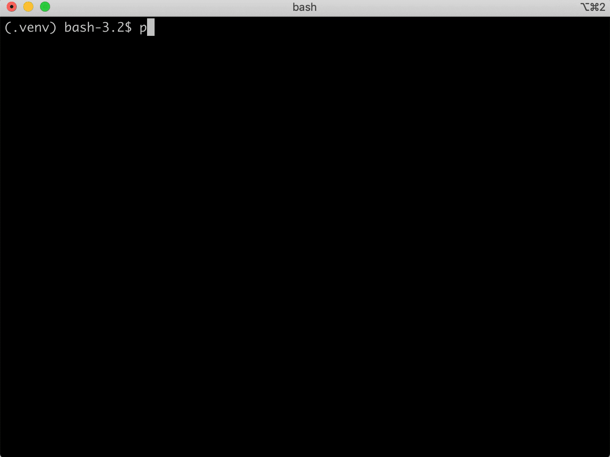

# django-migration-docs

Migrations can be one of the most challenging aspects of deploying a Django application at scale. Depending on the size of tables and flavor of database, some migrations can easily lock some of the most important tables and bring down an application if more scrutiny isn't applied towards deployed migrations. Along with this, sometimes we must document more critical metadata about a migration before it is even deployed, such as when the migration should run in the deployment process.

`django-migration-docs` provides the ability to collect more structured information about every migration in your Django project. Along with this, it also automatically collects important metadata about migrations like the raw SQL so that more information is available for reviewers and maintainers of a large project.

When `django-migration-docs` is installed, users will be prompted for more information about migrations using a completely customizable schema that can be linted in continuous integration. The default prompt looks like the following:

To get started with `django-migration-docs`, read the [Installation Guide](installation.md) and then go to the [Tutorial](tutorial.md).

## Compatibility

`django-migration-docs` is compatible with Python 3.8 - 3.12 and Django 3.2 - 4.2.
