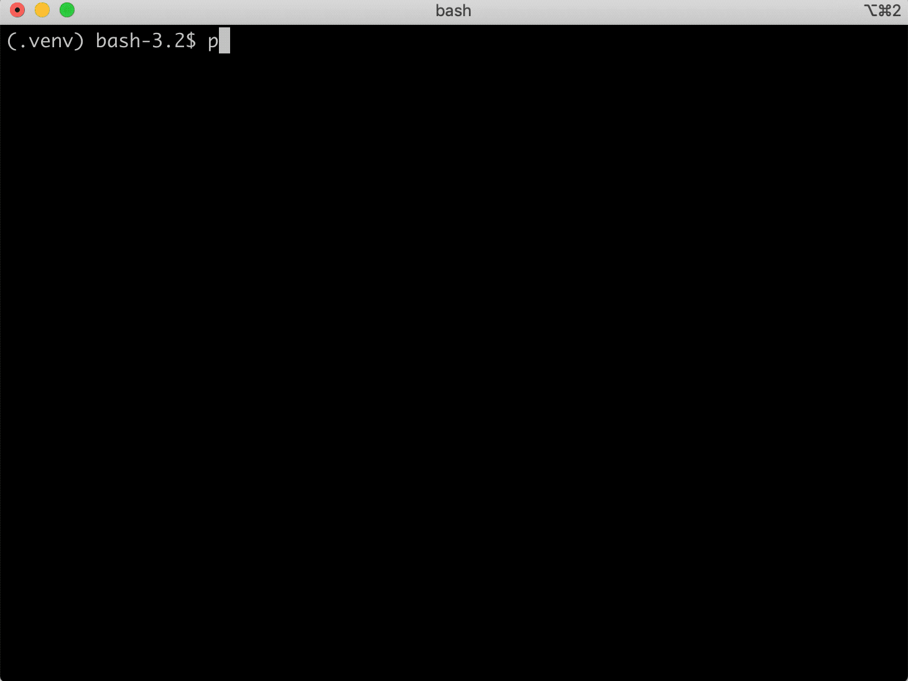
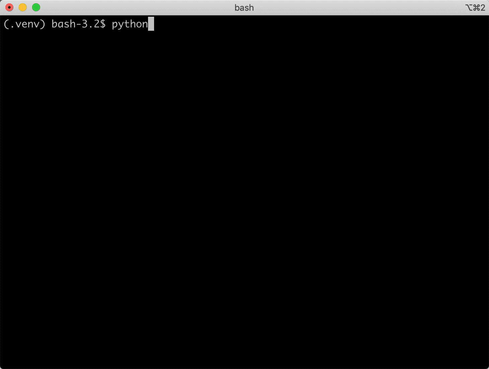

.. _tutorial:

Tutorial
========

Getting Started
~~~~~~~~~~~~~~~

To start using ``django-migration-docs`` in your project, first run the
following command::

  manage.py migration_docs bootstrap

This command will generate empty docs for all of the migrations currently
in your project.

If you'd prefer to manually enter migration docs for every migration in your
project, skip this step.

``django-migration-docs`` works by keeping additional documentation about
all migrations in your project in the ``.migration-docs/docs.yaml`` file.
All information entered through ``django-migration-docs`` commands will be
kept in this file and viewable in any pull requests that have migration
changes. For example, after running ``manage.py migration_docs bootstrap``,
you will see a new ``.migration-docs/docs.yaml`` file with keys for
every migration.

Syncing Migration Docs
~~~~~~~~~~~~~~~~~~~~~~

After bootstrapping a project, the documentation is kept in sync by
calling::

  manage.py migration_docs sync

The ``sync`` command operates in the following manner:

1. Finds any new migrations in the project. Collects metadata about those
   migrations and prompts the user for more information about the migration.
   More on how this works later.
2. Determines if any migration files have changed since the documentation was
   last synced. Automatically updates the metadata associated with any changed
   migrations.
3. Checks if any migrations that were previously documented have been deleted
   from the project. Documentation for these migrations is removed.

By default, ``django-migration-docs`` collects the following metadata
about every migration:

1. The ``hash`` of the migration, which is just an MD5 of the contents of
   the migration file.
2. If the migration is ``atomic``. If ``True``, this means the migration is
   executed in a transaction.
3. The raw ``sql`` for the migration. If the SQL cannot be determined for any
   reason, the exception and error message are stored in this attribute.

``django-migration-docs`` also prompts users to enter the following information
about each migration:

1. The ``point_of_contact`` for the migration. This is the person responsible
   for the migration, whether they authored it or installed/upgraded
   the third-party app that brought in the migrations.
2. An in-depth ``description``. Prompts the user for a description about the
   migration.

For example, here's a full flow of migration docs being synced where some
are updated, added, and deleted:

``django-migration-docs`` uses the
`formaldict library <https://github.com/jyveapp/formaldict>`__
to prompt users for structured information about the migration.

Syncing Custom Attributes
~~~~~~~~~~~~~~~~~~~~~~~~~

``django-migration-docs`` can be configured to collect all of the
attributes important to your organization by configuring a migration doc
schema in ``.migration-docs/migration.yaml``. The migration doc schema
is a representation of a ``formaldict`` ``Schema`` from the
`formaldict library <https://github.com/jyveapp/formaldict>`__ used
under the hood by ``django-migration-docs``. We will give some examples
of schemas here, but check out the
`formaldict docs <https://formaldict.readthedocs.io>`__
for more examples of configuring schemas.

The following ``.migration-docs/migration.yaml`` file contains a schema
that prompts for the migration author, a description, and the type of
migration:

.. code-block:: yaml

  - label: author
    help: The author of the migration.
  - label: description
    help: An in-depth description of the migration. Give some information
          about what big tables might be impacted and how long it takes the
          migration to run.
  - label: type
    help: When the migration should be executed in deployment. Choose "before"
          to execute the migration before code is deployed and "after" to
          executed it after code is deployed.
    choices:
      - before
      - after

By specifying this schema in the ``.migration-docs/migration.yaml`` file of
your Django project, users will be prompted to enter this information
when syncing migrations. For example:

The resulting ``.migration-docs/docs.yaml`` file looks something like this:

.. code-block:: yaml

    auth.0011_update_proxy_permissions:
      _hash: 4c2c17e4e9f7808c79a0f7a542e6c700
      atomic: true
      author: John Doe
      description: This is an in-depth description of the migration!
      sql: '--

        -- MIGRATION NOW PERFORMS OPERATION THAT CANNOT BE WRITTEN AS SQL:

        -- Raw Python operation

        --'
      type: before

.. tip::

  The `formaldict library <https://github.com/jyveapp/formaldict>`__ that
  parses the schema and prompts for information has many options, including
  the ability to conditionally prompt for more attributes based on
  previously-entered information. Check out
  `these docs <https://formaldict.readthedocs.io>`__
  for more information!

Updating Migration Docs
~~~~~~~~~~~~~~~~~~~~~~~

Sometimes migration docs need to be updated after they are initially entered.
This can be performed with::

  manage.py migration_docs update <migration_label> <migration_label>..

For example, if we want to update the docs for the migration in our previous
example, we'd do::

  manage.py migration_docs update auth.0011_update_proxy_permissions

Showing Migration Docs
~~~~~~~~~~~~~~~~~~~~~~

Similar to Django's ``manage.py showmigrations`` command,
``django-migration-docs`` allows users to render the migrations in whatever
manner necessary for their organization with::

  manage.py migration_docs show

By default, ``migration_docs show`` will render all migrations and
place an ``X`` next to the ones that are applied. It does so by using
the following `Jinja2 template <https://jinja.palletsprojects.com/>`__ to
render the migrations:

.. code-block:: jinja

  
  [X ] {{ migration.label }}
  

When ``manage.py migration_docs show`` is called, the migrations are loaded
in a `migration_docs.Migrations` object that is passed to the template.

Users can override
the `Jinja2 <jinja.palletsprojects.com>`__ template used for rendering the docs
by providing a ``.migration-docs/show.tpl`` Jinja2 template.
The ``migrations`` variable in the template is a list of `migration_docs.Migration` objects,
and each `migration_docs.Migration` not only has many of the base attributes
(e.g. ``sql``, ``applied``, ``hash``, etc), but also has an attribute for
every custom attribute specified in the ``.migration-docs/migration.yaml`` file.
This allows us to render whatever information about migrations are necessary.

For example, assume we are using the schema from our previous example. This
template will render the migration author and type of migration (using
Markdown format):

.. code-block:: jinja

  
  [X ] {{ migration.label }}
    **author** {{ migration.author }}
    **type** {{ migration.type }}
  

The ``migrations`` variable is a `migration_docs.Migrations` object, which allows filtering
and grouping on `migration_docs.Migration` attributes. For example, to group each migration
by ``type`` and show sections for each type, use the following template:

.. code-block:: jinja

    
    ## {{ type|default('no type specified', True) }}
    
    [X ] {{ migration.label }}
      **author** {{ migration.author }}
    
    

The template from above will result in output looking like:

.. highlight:: none

::

  ## no type specified
  [X] auth.0008_alter_user_username_max_length
    **author** None

  ## before
  [X] auth.0009_alter_user_last_name_max_length
    **author** John Doe

  ## after
  [X] auth.0010_alter_group_name_max_length
    **author** John Doe

Check out the `migration_docs.Migrations` doc for more methods that you can use in custom
Jinja templates. The `migration_docs.Migrations` construct also allows for arbitrary filtering
of `migration_docs.Migration` elements.

The ``manage.py migration_docs show`` command also comes with the following
options:

1. ``manage.py migration_docs show --unapplied`` - The ``--unapplied`` option
   automatically filters the ``migrations`` variable to only contain
   unapplied migrations. Note that this can also be accomplished by
   running ``migrations.filter('applied', False)`` in the template.
2. ``manage.py migration_docs show app_label1 app_label2`` - Provide an
   arbitrary number of app labels to only show migrations for those apps.
   Note that this can also be accomplished by running
   ``migrations.intersect('app_label', ['app_label1', 'app_label2'])`` in
   the template.
3. ``manage.py migration_docs show --style=value`` - When given a ``style``,
   the command looks for a template in the ``.migration-docs/show_{style}.tpl``
   file and uses that template.

Verifying that Migration Docs are Synced
~~~~~~~~~~~~~~~~~~~~~~~~~~~~~~~~~~~~~~~~

Check that migration docs have been synced with::

  manage.py migration_docs check

The command exits with an error code of 1 if any errors are found. This
command is intended to be executed in a continuous integration environment
with pull requests to ensure that migration docs are up to date.

.. note:: The ``check`` subcommand does not currently verify that the
  contents of the ``.migration-docs/docs.yaml`` file matches the schema
  in ``.migration-docs/schema.yaml``. We are considering adding this
  as an optional check in a later release of ``django-migration-docs``.

Automatically Syncing Docs
~~~~~~~~~~~~~~~~~~~~~~~~~~

Migration docs can automatically be synced when running migrations. This
can be useful so that engineers do not have to remember to add migrations.
Set the ``MIGRATION_DOCS_PRE_MIGRATE_SYNC`` setting to ``True`` in your
settings file, and migration docs will be synced when anyone runs
``manage.py migrate``.

.. tip::

  It's recommended to only enable this setting in local development mode.
  Otherwise engineers may accidentally be prompted for migration docs
  when doing production deployments and migrations.

Configuring Pre-Sync Hooks
~~~~~~~~~~~~~~~~~~~~~~~~~~

``django-migration-docs`` will automatically update docs for migrations
when migration files change. It will similarly report that docs need to be
synced during ``manage.py migration_docs check`` if the contents of any
migrations have been changed since the last time docs were synced.

This flow can be problematic for users that use automated code
formatters like `black <https://black.readthedocs.io/en/stable/>`__.
E.g. depending on the setup of the repo, a user could sync migration docs,
automatically format the migration code with ``black``, and then have
to re-sync docs again.

This flow can be avoided by configuring the ``MIGRATION_DOCS_PRE_SYNC_HOOKS``
setting. Add commands that need to be executed before syncing migration docs
to this setting and they will automatically be executed before syncing
any migrations. For example, to run ``black`` before syncing, do::

  MIGRATION_DOCS_PRE_SYNC_HOOKS = ['black .']
